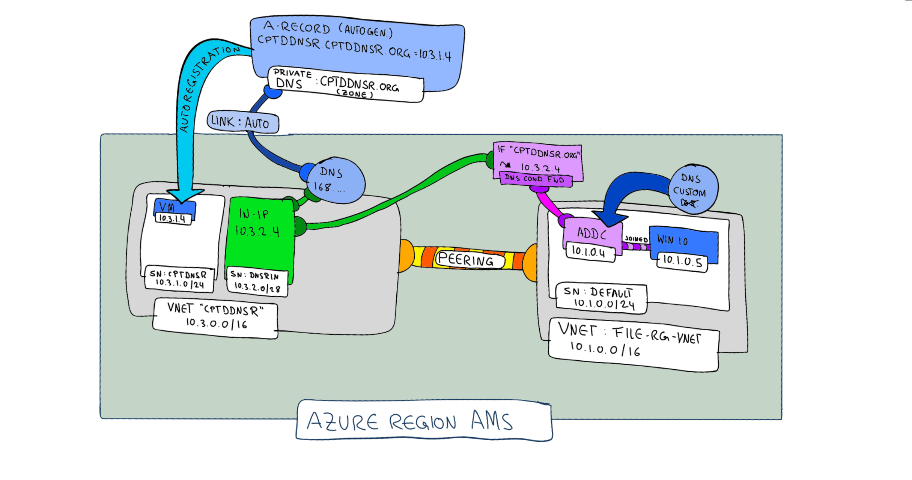
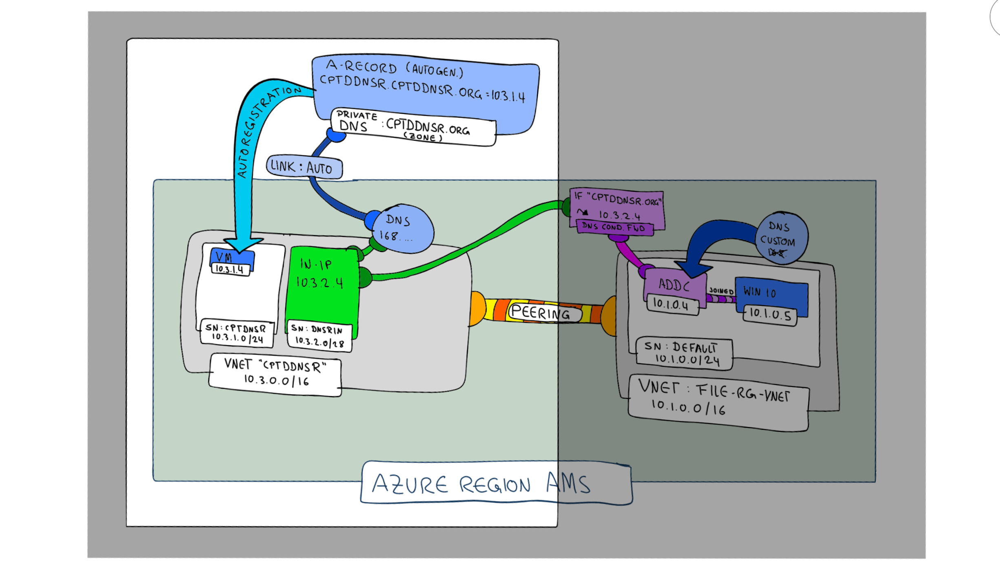
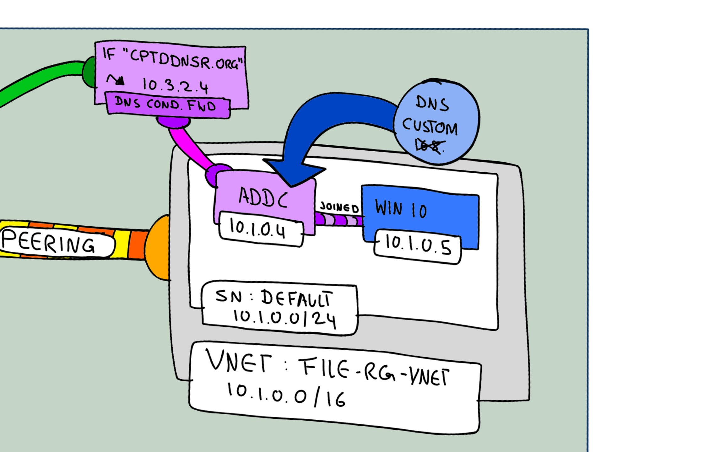

# Azure private DNS resolver Samples

## Simple private DNS resolver demo

Based on:
- https://docs.microsoft.com/en-us/azure/dns/dns-private-resolver-get-started-portal
- https://docs.microsoft.com/en-US/cli/azure/dns-resolver?view=azure-cli-latest

The following sample demonstrates how to create a private DNS resolver inbound rule.

The sample includes:
- Azure Private DNS zone "cptddnsr.org" which use autoregistration 
- a VM called "VM" which does get auto-registered by the private DNS zone "cptddnsr.org"
- a VM called "ADDC" which runs Windows Server with DNS service enabled and conditional DNS configured to point to the private DNS resolver.
- a VM called "WIN10" which will be used to send a DNS query which will be finally resolved by the private DNS zone via the private DNS resolver.

The following sequence diagram does show how the DNS query does get resolved.

- VM: VM which does get autoregistered via Azure private DNS (10.3.1.4)
- ADDC: The VM which does run the DNS Service (10.1.0.4)
- WIN10: The VM which acts as a client (10.1.0.5)
- DNSRInbound: The Azure private DNS resolver inbound service (10.3.2.4)
- AzPrivateDNSZone: The Azure private DNS zone which will be used to autoregister  (cptddnsr.org.)

~~~ mermaid
sequenceDiagram
    participant WIN10
    participant ADDC
    participant DNSRInbound
    participant AzPrivateDNSZone
    WIN10->>ADDC: DNS query resolve cptddnsr.cptddnsr.org.
    Note right of ADDC: verify if conditional dns forward exists
    ADDC-->>DNSRInbound: fwd DNS query for cptddnsr.cptddnsr.org.
    DNSRInbound->>AzPrivateDNSZone: fwd DNS query for cptddnsr.cptddnsr.org.
    Note right of AzPrivateDNSZone: resolve to IP 10.3.1.4
    AzPrivateDNSZone->>DNSRInbound: fwd IP 10.3.1.4
    DNSRInbound->>ADDC: fwd IP 10.3.1.4
    ADDC->>WIN10: IP 10.3.1.4
~~~

The idea of the Azure private DNS resolver is to overcome the challenge with the none routable IP 168.63.129.16 which does provide DNS services inside a azure vNet. The issue is described [here](https://docs.microsoft.com/en-us/answers/questions/181776/azure-private-dns-zone-resolution-from-on-prem.html) in more details. To overcome the need to setup your own VMs which run a DNS Server (IaaS) Azure now offers a managed version (PaaS). Because our demo does not include a real on-prem enviroment we are going to mimic one by using two VNets which are connected via vnet peering with each other.

> IMPORTANT: The templates and commands provide here will only create parts of the enviroment.
The grey area is not covered by the templates and commands of this repo.

In case you like to create the whole enviroment the following repo could be helpfully:
- [Github repo to create a ADDC](https://github.com/Azure/azure-quickstart-templates/tree/master/application-workloads/active-directory/active-directory-new-domain-module-use)
- [How to setup conditional forwarding on MS Server](https://www.interfacett.com/blogs/windows-server-how-to-configure-a-conditional-forwarder-in-dns/)

Register the private DNS resolver at our Azure subscription

> NOTE: At the time of writing, Azure private DNS resolver is still in preview. Therefore we need to verify if Azure privat DNS resolver is registered under your subscription.

~~~ bash
az provider register --namespace Microsoft.Network # register the whole namespace wich also includes the dns-resolver
az provider show --namespace Microsoft.Network -o table --query resourceTypes[].resourceType -o table | grep dnsResolvers # verify if dnsResolver has been installed
~~~

Env. variables which will be used during this demo.

~~~ bash
prefix=cptddnsr
location=eastus
myip=$(curl ifconfig.io) # Just in case we like to whitelist our own ip.
myobjectid=$(az ad user list --query '[?displayName==`ga`].id' -o tsv) # just in case we like to assing some RBAC roles to ourself.
~~~

Create foundation resources.

~~~ bash
az group create -n $prefix -l $location
az deployment group create -n $prefix -g $prefix --mode incremental --template-file bicep/deploy.bicep -p prefix=$prefix myobjectid=$myobjectid location=$location myip=$myip
# Add existing infrastructe which does mimic onprem with AADC and windows and linux clients.
rgop=file-rg
vnetop=file-rg-vnet
vnetlinuxid=$(az network vnet show -g $rgop -n $vnetop --query id -o tsv) # VNet id of onprem representation.
az network vnet peering create -n hub2onprem --remote-vnet $vnetlinuxid -g $prefix --vnet-name $prefix --allow-forwarded-traffic --allow-vnet-access # peer with our hub vnet.
vnetid=$(az network vnet show -g $prefix -n $prefix --query id -o tsv) # Retrieve vnet id.
az network vnet peering create -n onprem2hub --remote-vnet $vnetid -g $rgop --vnet-name $vnetop  --allow-forwarded-traffic --allow-vnet-access # peer with our onprem vnet.
~~~

Create the private DNS resolver.

~~~ bash
subnetinid=$(az network vnet subnet show -g $prefix -n dnsrin --vnet-name $prefix --query id -o tsv) # Retrieve subnet in id.
subnetoutid=$(az network vnet subnet show -g $prefix -n dnsrout --vnet-name $prefix --query id -o tsv) # Retrieve subnet out id.
az dns-resolver create -n $prefix -g $prefix -l $location --id $vnetid # create private dns resolver inside vnet.
az dns-resolver inbound-endpoint create --dns-resolver-name $prefix -n $prefix -g $prefix --ip-configuration private-ip-address="" private-ip-allocation-method=dynamic id=$subnetinid -l $location
az dns-resolver outbound-endpoint create --dns-resolver-name $prefix -n $prefix -g $prefix -l $location --id $subnetoutid
dnsinip=$(az dns-resolver inbound-endpoint show --dns-resolver-name $prefix -n $prefix -g $prefix --query ipConfigurations[].privateIpAddress -o tsv)
dnsoutip=$(az dns-resolver outbound-endpoint show --dns-resolver-name $prefix -n $prefix -g $prefix --query ipConfigurations[].privateIpAddress -o tsv) 
dnsoutid=$(az dns-resolver outbound-endpoint show --dns-resolver-name $prefix -n $prefix -g $prefix --query id -o tsv) 
az dns-resolver forwarding-ruleset create -n $prefix -l $location -g $prefix --outbound-endpoints id=$dnsoutid
dcip=$(az network nic show --ids $(az vm show -g $rgop -n dc-01-win-vm --query networkProfile.networkInterfaces[0].id -o tsv) --query ipConfigurations[0].privateIpAddress -o tsv)
az dns-resolver forwarding-rule create --forwarding-rule-name $prefix -g $prefix --ruleset-name $prefix --domain-name myedge.org. --forwarding-rule-state Enabled --target-dns-servers ip-address="${dcip}"
vnetspokeid=$(az network vnet show -g $prefix -n ${prefix}spoke --query id -o tsv) # Retrieve vnet id.
az dns-resolver vnet-link create -n $prefix -g $prefix --ruleset-name $prefix --id $vnetspokeid 
~~~

As part of the foundation resources we created a private DNS zone.
Let us get all A-Records for this zone.

~~~ bash
az network private-dns zone show -g $prefix -n ${prefix}.org
az network private-dns record-set list -g $prefix -z ${prefix}.org --query '[?type==`Microsoft.Network/privateDnsZones/A`].{aRecords:aRecords,fqdn:fqdn}'
~~~

Result

~~~ json
[
  {
    "aRecords": [
      {
        "ipv4Address": "10.3.1.4"
      }
    ],
    "fqdn": "cptddnsr.cptddnsr.org."
  }
]
~~~

### Test Inbound case

Resolve the A-Record from two vm which are deployed under resource group "file-rg": 
- a linux vm
 - Name: linux
- a WIN10 vm (domain joined)
 - Name: client-01-win-vm
Like mentioned at the beginning, some part of the resources are not covered by the templates of this repo.
The WIN10 vm and the linux vm are such resources:

~~~ bash
az network private-dns record-set list -g $prefix -z ${prefix}.org --query '[?type==`Microsoft.Network/privateDnsZones/A`].{fqdn:fqdn}' -o tsv # Print fqdn of our spoke vm. Will be cptddnsr.cptddnsr.org in our case.
vmopid=$(az vm show -g $rgop -n linux --query id -o tsv)
vmlinuxid=$(az vm show -g $rgop -n linux --query id -o tsv)
az network bastion ssh -n ${prefix}bastion -g $prefix --target-resource-id $vmlinuxid --auth-type password --username chpinoto 
# use the fqdn of our spoke vm, autogenerated by our private dns zone.
dig cptddnsr.cptddnsr.org.
~~~

Outcome:
~~~ text
;; ANSWER SECTION:
cptddnsr.cptddnsr.org.  9       IN      A       10.3.1.4
~~~

Same result can be achieved via windows client.

~~~ powershell
vmwinid=$(az vm show -g $rgop -n client-01-win-vm --query id -o tsv)
az network bastion rdp -n ${prefix}bastion -g $prefix --target-resource-id $vmwinid
~~~

Outcome:
~~~ text
nslookup cptddnsr.cptddnsr.org
Server:  UnKnown
Address:  10.1.0.4

Non-authoritative answer:
Name:    cptddnsr.cptddnsr.org
Address:  10.3.1.4
~~~

- "Address:  10.3.1.4" IP of the VM called "VM".
- "Address:  10.1.0.4" Ip of the VM ADDC which does provide DNS to WIN10 and is setup with conditional DNS forwarding.

### Test Outbound case

~~~ bash
vmlinuxid=$(az vm show -g $rgop -n linux --query id -o tsv)
az network bastion ssh -n ${prefix}bastion -g $prefix --target-resource-id $vmlinuxid --auth-type password --username chpinoto 
dig client-01-win-v.myedge.org. #the last letter of vm has been cut of by addc
dig dc-01-win-vm.myedge.org.
~~~

Outcome:
~~~ text
;; ANSWER SECTION:
client-01-win-v.myedge.org. 1200 IN     A       10.1.0.5
~~~

### Clean up

~~~ bash
az group delete -n $prefix -y
~~~

# Misc

## private DNS resolver tips and tricks

~~~ bash
# Verify dns resolver state.
az dns-resolver show -n $prefix -g $prefix --query dnsResolverState 
nslookup dc-01-win-vm.myedge.org # look domain controller.
~~~

## general usefull cli commands

~~~ bash
az resource list -g $prefix -o table # list all azure resource inside a resource group.
az network vnet peering list -g $prefix --vnet-name $prefix --query [].name
az network vnet peering list --vnet-name file-rg-vnet -g file-rg --query [].name
az network vnet peering delete -n hub-appproxy --vnet-name file-rg-vnet -g file-rg
~~~

## gh, git tips and tricks

~~~ bash
gh repo create $prefix --public
git remote add origin https://github.com/cpinotossi/$prefix.git
git status
git add *
git commit -m"seperate pdns into own bicep module"
git push origin main 
~~~